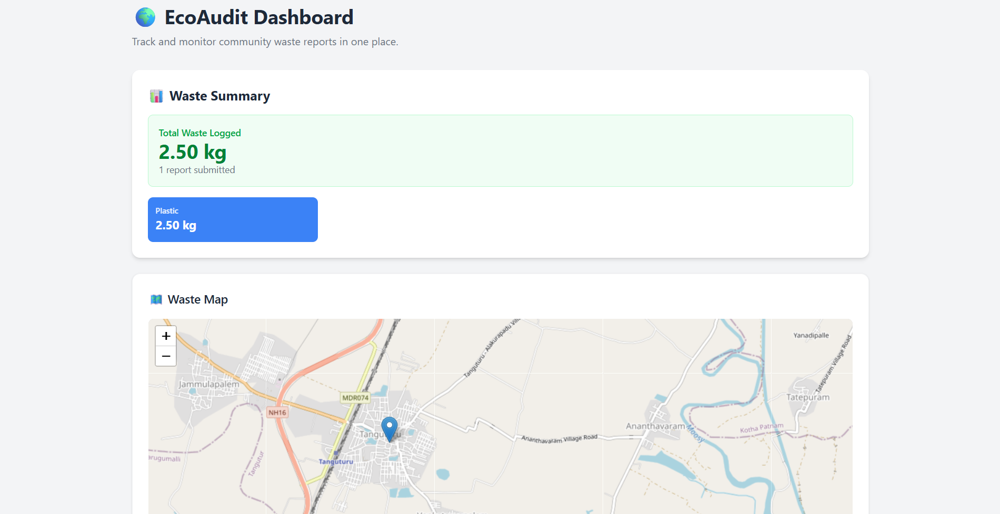
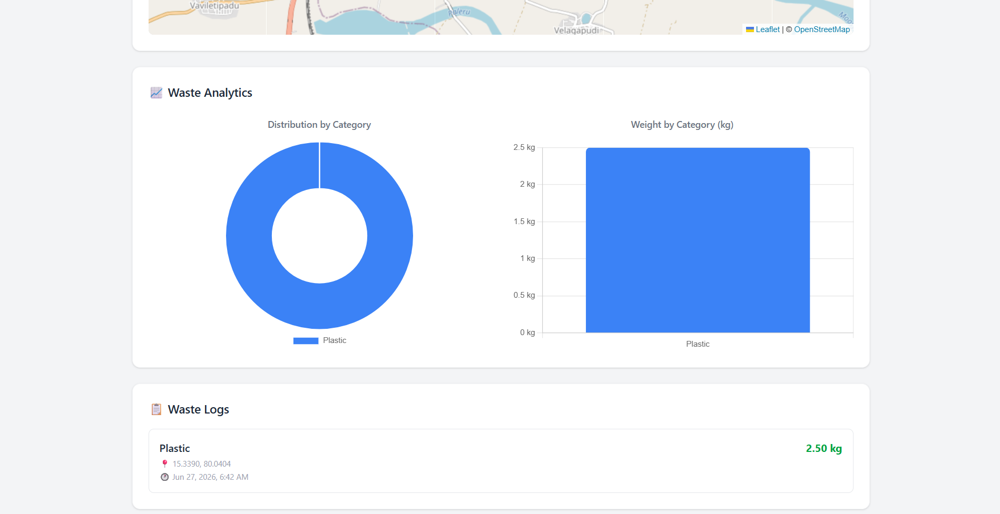
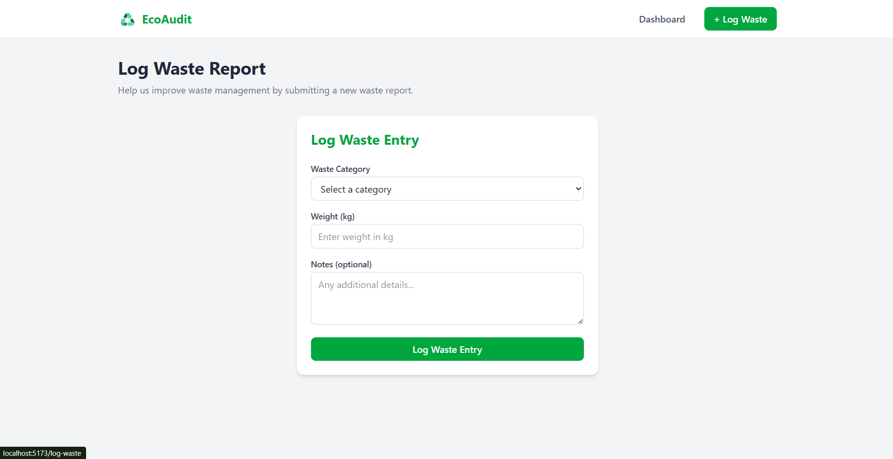
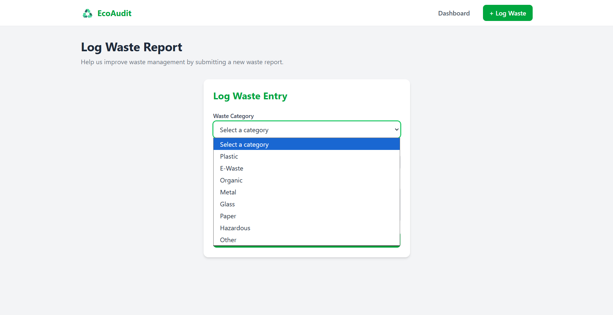

# ♻️ EcoAudit
### Community Waste Logging & Analytics Platform

EcoAudit is a full-stack web application that enables users to log community waste reports with automatic GPS location capture. The application stores reports in Firebase Firestore and provides real-time analytics through interactive dashboards, charts, and maps to help visualize waste management data.

Built for the **CodeChef VITC Projects Department** Recruitment Task.

---

## 🔗 Links

- **Live Demo:** https://your-vercel-link.vercel.app
- **GitHub:** https://github.com/25f2005396/ecoaudit

---

## 🛠️ Tech Stack

| Layer | Technology |
|-------|------------|
| Frontend | React + Vite |
| Styling | Tailwind CSS v4 |
| Database | Firebase Firestore |
| Maps | Leaflet + React-Leaflet |
| Charts | Chart.js + React-Chartjs-2 |
| Deployment | Vercel |

---

## ✨ Features

### MVP Features
- ✅ Log waste entries with category and weight
- ✅ Automatic GPS location capture (no manual input)
- ✅ Audit dashboard showing all submitted logs
- ✅ Live totals by waste category
- ✅ Data persisted in Firebase Firestore

### Bonus Features
- ✅ Map visualization with Leaflet pins
- ✅ Waste analytics with Doughnut and Bar charts
- ✅ Location error handling (deny permission)
- ✅ Loading states and empty states
- ✅ Form validation before GPS prompt

---

## 📁 Project Structure

```text
src/
├── assets/
├── components/
│   ├── EmptyState.jsx
│   ├── LoadingSpinner.jsx
│   ├── MapView.jsx
│   ├── Navbar.jsx
│   ├── TotalStats.jsx
│   ├── WasteChart.jsx
│   ├── WasteForm.jsx
│   └── WasteLogCard.jsx
├── constants/
│   ├── appConfig.js
│   ├── chartOptions.js
│   ├── colors.js
│   ├── routes.js
│   └── wasteCategories.js
├── firebase/
│   └── firebase.js
├── hooks/
│   └── useGeolocation.js
├── layouts/
│   └── MainLayout.jsx
├── pages/
│   ├── Dashboard.jsx
│   ├── LogWaste.jsx
│   └── NotFound.jsx
├── services/
│   └── firestoreService.js
└── utils/
    ├── calculations.js
    ├── chartConfig.js
    ├── geolocation.js
    └── leafletConfig.js
```

---

## 🚀 Running Locally

### Prerequisites

- Node.js v18 or higher
- A Firebase project with Firestore enabled

### Steps

**1. Clone the repository:**

```bash
git clone https://github.com/25f2005396/ecoaudit.git
cd ecoaudit
```

**2. Install dependencies:**

```bash
npm install
```

**3. Create a `.env` file in the root of the project:**

```env
VITE_FIREBASE_API_KEY=your_api_key
VITE_FIREBASE_AUTH_DOMAIN=your_auth_domain
VITE_FIREBASE_PROJECT_ID=your_project_id
VITE_FIREBASE_STORAGE_BUCKET=your_storage_bucket
VITE_FIREBASE_MESSAGING_SENDER_ID=your_sender_id
VITE_FIREBASE_APP_ID=your_app_id
```

**4. Start the development server:**

```bash
npm run dev
```

**5. Open in your browser:**

```
http://localhost:5173
```

---

## 📱 How to Use

1. Navigate to the **+ Log Waste** page
2. Select a waste category from the dropdown
3. Enter the weight in kg
4. Add optional notes
5. Click **Log Waste Entry**
6. Allow location access when the browser prompts
7. View your entry on the **Dashboard**

---

## 📊 Dashboard Overview

- **Waste Summary** — total kg logged and report count
- **Category Breakdown** — color-coded cards per category
- **Waste Map** — Leaflet map with pins at logged locations
- **Waste Analytics** — Doughnut and Bar charts
- **Waste Logs Feed** — all entries with location and timestamp

---

## 📸 Screenshots

### 🏠 Dashboard — Summary & Map



### 📊 Dashboard — Analytics & Logs



### 📝 Log Waste Form



### 🗂️ Waste Categories



---

## 🔒 Environment Variables

This project uses Firebase. Never commit your `.env` file.
The `.env` file is listed in `.gitignore` and will never be pushed to GitHub.

Firestore is configured using Firebase Security Rules. Environment variables are not committed to GitHub and should be configured in your hosting platform's settings.

To deploy, add your environment variables in Vercel:
> Project Settings → Environment Variables

---

## 👨‍💻 Author

**Venkata Naga Teja N.**

GitHub: https://github.com/25f2005396